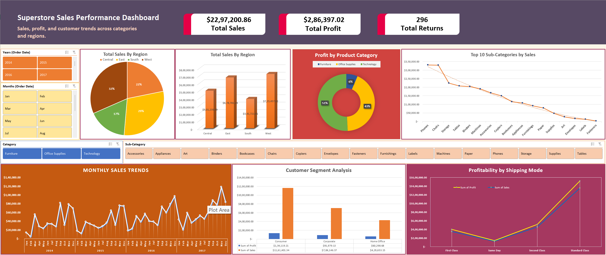

# Superstore Sales Dashboard – Excel Project

This project analyzes the Global Superstore dataset using Microsoft Excel to uncover trends in sales, profit, returns, and customer behavior across categories, regions, and segments.

## Project Overview
- Tool: Microsoft Excel
- Time Period: 2014–2017
- Dataset: Global Superstore
- Objective: Build an interactive dashboard to drive business insights.

## Files Included
- `Superstore-Sales-Analysis and Dashboard` – Final Excel Dashboard with slicers, charts, and KPIs.
- `Superstore Insights Report.pdf` – A structured business report summarizing key findings and recommendations.
- `Sample - Superstore.xls` - Original Dataset.

## Dashboard Highlights
- Monthly Sales Trends with seasonal insights
- Sales & Profit by Region, Category, Segment
- Top 10 Sub-Categories
- Shipping Mode Performance
- Slicers for Year, Month, Category, and Sub-Category

## Key Business Insights
- Technology is the most profitable category
- West region leads in overall performance
- Same-day shipping underperforms in profit
- Consumer segment dominates in both sales and returns

## Skills Demonstrated
- Excel Pivot Tables & Pivot Charts
- Slicers & Interactivity
- Data Cleaning
- Dashboard Design
- Business Analysis
## Dashboard Preview

---

**Created by:** Rajat Kumar 
**Connect with me on [LinkedIn](https://www.linkedin.com/in/rajat-kumar-analyst/)**  
